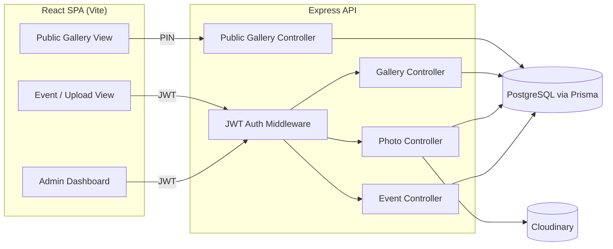

# Photo Sharing Platform

A full-stack photo-sharing app built for the TrizenAI Full-Stack Internship Challenge.

A photography/event team collaboratively uploads photos for an event. An Admin/Lead
reviews everything, selects the best shots, and publishes a PIN-protected gallery.
The customer opens a shareable link, enters the PIN, and views the gallery — no
account required.

## Table of Contents
- [Tech Stack](#tech-stack)
- [Architecture](#architecture)
- [Database Design](#database-design)
- [Local Setup](#local-setup)
- [Environment Variables](#environment-variables)
- [Testing](#testing)
- [Deployment](#deployment)
- [Demo Credentials](#demo-credentials)
- [Known Limitations](#known-limitations)
- [Project Structure](#project-structure)

## Tech Stack

**Frontend** — React 19 (Vite), React Router, Tailwind CSS, Axios
**Backend** — Node.js, Express 5, Prisma ORM
**Database** — PostgreSQL
**Photo Storage** — Cloudinary (object storage — image files are never stored in the DB, only their URLs/metadata)
**Auth** — JWT (separate short-lived tokens for staff logins vs. customer gallery access)
**Testing** — Jest + Supertest

No framework was mandated by the brief; this stack was chosen for fast iteration and
because Cloudinary removes the need to manage a separate storage bucket/CDN for a
project this size.

## Architecture



**Request flow in one line:** Admin/Member requests carry a JWT verified by
`middleware/auth.js`; role checks (`restrictTo`) gate Admin-only actions
(create event, add members, manage gallery). Customer requests hit a separate
set of public routes (`routes/publicGallery.js`) that require no login — only
a correct PIN, verified against a bcrypt hash, unlocks a short-lived customer
access token.

## Database Design

Five tables, managed by Prisma migrations (`server/prisma/schema.prisma`):

| Table | Purpose |
|---|---|
| `User` | Admins and Team Members (role-flagged), password hashed with bcrypt |
| `Event` | One event per Admin-created shoot; owned by exactly one Admin |
| `EventMember` | Join table — which Users (Members) are assigned to which Event |
| `Photo` | Metadata only (filename, Cloudinary URL, uploader, file size, timestamps) — never the image bytes |
| `Gallery` | One-to-one with Event; holds the slug, bcrypt-hashed PIN, and published flag |
| `GalleryPhoto` | Join table — which Photos are selected into a Gallery |

Key relationships: `Event 1—1 Gallery`, `Event 1—N Photo`, `Event N—N User`
(via `EventMember`), `Gallery N—N Photo` (via `GalleryPhoto`). Deleting an
Event cascades to its members, photos, gallery, and gallery-photo links.

## Local Setup

### Prerequisites
- Node.js 18+
- A PostgreSQL database (local or hosted — e.g. Neon, Supabase, Railway)
- A Cloudinary account (free tier is enough)

### Server
```bash
cd server
npm install
cp .env.example .env      # fill in DATABASE_URL, JWT_SECRET, CLOUDINARY_*
npx prisma migrate deploy # applies existing migrations
npm run dev                # starts on http://localhost:5000
```

### Client
```bash
cd client
npm install
cp .env.example .env      # optional locally — defaults to http://localhost:5000/api
npm run dev                # starts on http://localhost:5173
```

Open `http://localhost:5173`, register an Admin account and a Member account,
then log in as the Admin to create an event and add the Member by email.

## Environment Variables

**`server/.env`**

| Variable | Required | Description |
|---|---|---|
| `DATABASE_URL` | Yes | PostgreSQL connection string |
| `JWT_SECRET` | Yes | Signing secret for both staff and customer JWTs |
| `CLOUDINARY_CLOUD_NAME` | Yes | From your Cloudinary dashboard |
| `CLOUDINARY_API_KEY` | Yes | From your Cloudinary dashboard |
| `CLOUDINARY_API_SECRET` | Yes | From your Cloudinary dashboard |
| `PORT` | No | API port, defaults to `5000` |

**`client/.env`**

| Variable | Required | Description |
|---|---|---|
| `VITE_API_BASE_URL` | No (required in production) | Full URL of the deployed API, e.g. `https://api.example.com/api`. Falls back to `http://localhost:5000/api` when unset. |

See `.env.example` in each folder. Neither `.env` file is committed to Git.

## Testing

```bash
cd server
npm test
```

Covers, via Jest + Supertest against a real test database:
- Authentication (register/login, invalid credentials)
- Role-based authorization (Member blocked from Admin-only actions, cross-event access blocked)
- Gallery publishing workflow (create → select photos → publish)
- Public gallery PIN verification (correct/incorrect PIN, unpublished galleries return the same "not found" response as non-existent ones)
- Photo access controls (Admin-only delete)

## Deployment

_To be filled in once deployed — see below for the plan:_

- **Database:** [hosted Postgres provider — TBD]
- **API (server):** [hosting provider — TBD], `npm run dev`'s equivalent start
  command in production is `node src/server.js`; run `npx prisma migrate deploy`
  as a release step
- **Client:** [static hosting provider — TBD], build with `npm run build`,
  set `VITE_API_BASE_URL` to the deployed API URL at build time
- **Photo storage:** Cloudinary (already cloud-hosted, no extra deployment step)

**Live URL:** _TBD_
**Source repository:** _TBD_

## Demo Credentials

_To be filled in after seeding the deployed database:_

| Role | Email | Password |
|---|---|---|
| Admin | _TBD_ | _TBD_ |
| Team Member | _TBD_ | _TBD_ |

**Demo Gallery:** URL _TBD_ · PIN _TBD_

## Known Limitations

- No rate limiting on `/login` or the public PIN-verification endpoint —
  a determined attacker could brute-force a 4-digit PIN. Would add
  `express-rate-limit` in a future pass.
- No `helmet` (or equivalent) security-headers middleware yet.
- CORS currently allows all origins (`cors()` with no options) — fine for
  this submission, should be restricted to the deployed client origin in a
  production hardening pass.
- No image thumbnailing/resizing — full-size images are served directly from
  Cloudinary, which is fine at this scale but would benefit from Cloudinary's
  transformation URLs for large events.
- No pagination on the photo grid — acceptable for typical event volumes,
  but a very large event (1000+ photos) would benefit from it.
- A gallery's PIN cannot be re-displayed to the Admin after creation (only
  its bcrypt hash is stored, by design) — the Admin must keep their own
  record of it if they need to re-share it later.
- One gallery per event (matches the brief's workflow; multiple galleries
  per event was out of scope).

## Project Structure

```
photo-sharing-platform/
├── client/                 # React (Vite) frontend
│   ├── src/
│   │   ├── api/            # Axios instance + interceptor
│   │   ├── context/        # Auth context (JWT + user in localStorage)
│   │   ├── components/     # Navbar, ProtectedRoute
│   │   └── pages/          # Login, Register, AdminDashboard, EventDetail, CustomerGallery
│   └── .env.example
├── server/                  # Express API
│   ├── prisma/              # schema.prisma + migrations
│   ├── src/
│   │   ├── config/          # Prisma client, Cloudinary config
│   │   ├── controllers/     # Business logic per resource
│   │   ├── middleware/      # auth, customerAccess, upload, errorHandler
│   │   ├── routes/          # Route definitions
│   │   └── utils/           # AppError, jwt, slug helpers
│   ├── tests/                # Jest + Supertest suites
│   └── .env.example
└── README.md
```
